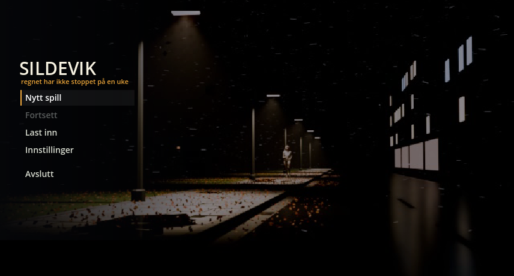
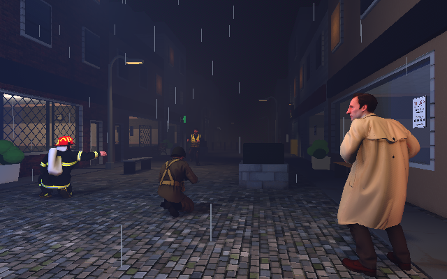
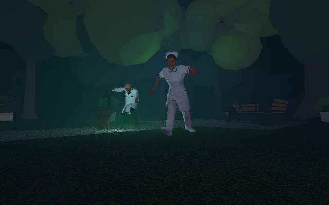
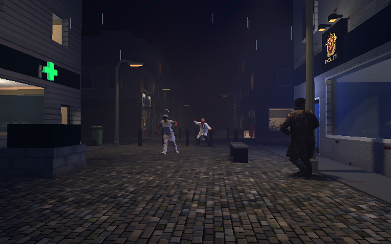
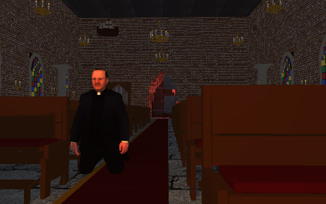
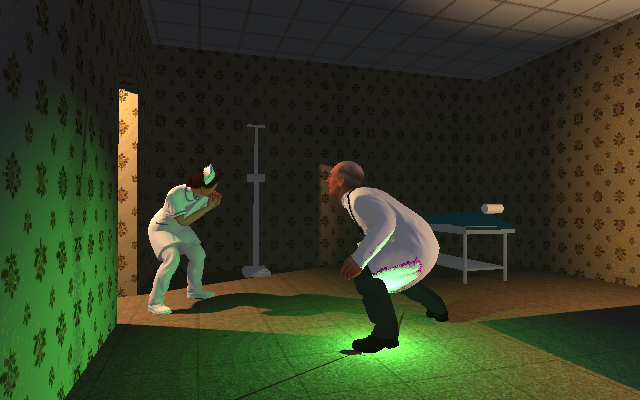
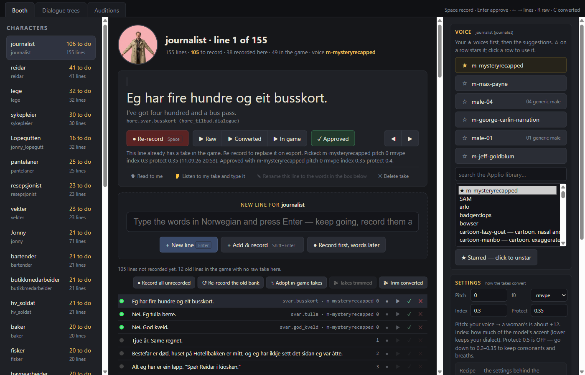
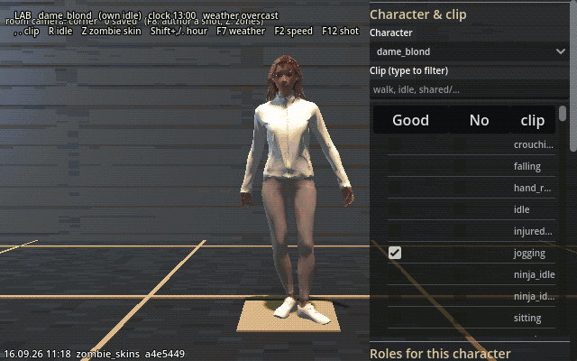
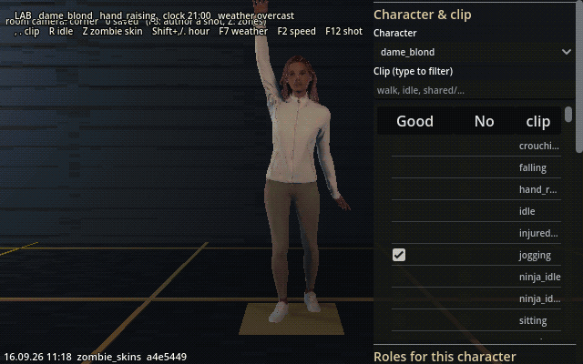

# S I L D E V I K

### *A point-and-click adventure on the Norwegian coast, 1990s.*

**Tech demo**

 

<i>The title screen. One of several opening scenes, picked at random each run.</i>

 

It is late October in Sildevik, a small town on the Rogaland coast. The rain
has not stopped for a week, the tube light in the kiosk has been dying for
longer than that, and something has gone badly wrong at the south end of
Langgata.

You are a journalist in a tan trench coat, with a notebook, an empty wallet
and no reason anyone here should talk to you. Walk the wet cobbles of Gågadå.
Look at everything. Talk to everyone. Pick up what isn't nailed down.

 

## What this is

An early, playable slice of a game in development: one street, its shops
and back rooms, the people who stand around in the rain, and the first
conversations. It is here to show the look and the feel, not to be finished.
Expect rough edges, placeholder props and doors that lead nowhere yet.

**This build has no recorded voices.** Every line still appears as text over
the speaker's head, in English or Norwegian. The voiced version is not
public.

 

## Play it

1. Download `Sildevik-techdemo-<version>.zip` from the
   [Releases](../../releases) page.
2. Unzip anywhere and run `Sildevik.exe`. Nothing is installed; saves go to
   `%APPDATA%\Godot\app_userdata\Sildevik`.
3. Windows 10/11, 64-bit, a GPU with Vulkan support. The game renders at
   640×400 and scales to the window.

Windows may warn that the file is from an unknown publisher: the build is
not code-signed. Play is mouse only.

| | |
|---|---|
| **Left click** | walk there, look at it, talk to them, pick it up, go through the door |
| **Drag an item** from your pockets onto a person or thing | use it |
| **Space** | show what can be clicked |
| **Esc** | menu, options, language |

 

## Around town

<table>
<tr>
<td width="33%"></td>
<td width="33%"></td>
<td width="33%"></td>
</tr>
<tr>
<td align="center"><i>The cordon, south end of Langgata. Thunderstorm.</i></td>
<td align="center"><i>Kirkeparken, 23:30.</i></td>
<td align="center"><i>Langgata, 02:00, rain.</i></td>
</tr>
</table>

<table>
<tr>
<td width="50%"></td>
<td width="50%"></td>
</tr>
<tr>
<td align="center"><i>Inside the church.</i></td>
<td align="center"><i>Legekontoret, 22:00.</i></td>
</tr>
</table>

 

## The feel of it

Sildevik is drawn at 640×400 through one fixed palette of 232 colours: low
resolution and heavy with weather, lit by sodium lamps, shop windows and the
occasional flash of lightning. The camera stays still like a film's does:
long fixed shots from the corners of rooms and under streetlamps, cutting
only when it has to.

It plays fair, in the old tradition. There are no dead ends, no sudden deaths
and no puzzle you can lock yourself out of.

 

## Made with

The town itself -- streets, facades, doors, lights -- is generated: a Python
script describes every parcel and prop, and [FuncGodot](https://github.com/func-godot/func_godot_plugin)
compiles that into the level geometry [Godot 4.7](https://godotengine.org/)
runs. The interiors people actually walk into -- the pub, the pharmacy, the
church, the kiosk -- are hand-built rooms in **Blender**, exported straight
into the engine. Dialogue trees run on [Dialogue Manager](https://github.com/nathanhoad/godot_dialogue_manager).

The cast, the signage, the textures on every wall: **ComfyUI**, running
locally, generating turnarounds, cutouts, shop signs and material art from a
mix of image models, which then get cut down to a fixed 232-colour palette
before anything ships. From a character's cutout views, a 3D mesh is
generated and brought in as the base body. Rigging and the shared animation
library both come from **Mixamo** -- one rig per body, retargeted so every
clip plays across the whole cast rather than being hand-keyed per character.

Every voice is a real recording, not text-to-speech: Olti performs every
line himself, and **Applio** (voice conversion, not synthesis) turns that
performance into each character's own voice. Sound effects, the radio
station's music and its ad breaks, and the announcer's voice, are generated
with **ElevenLabs**.

None of this is glued together by hand each time. A fair amount of the
project is its own tooling, purpose-built to move a generated or recorded
asset straight into the game with nothing lost in translation:

- **Voice Booth** -- records a line, sends it through Applio, and writes the
  approved take straight into the game's audio folder with its subtitle, all
  in one pass. One tab of it browses every recorded line by character; a
  second draws whole conversations from the lines a character already has
  and exports them as playable dialogue trees; a third auditions several
  Applio voice models against one line before committing a character to one.
- **Laben** -- a walled test yard with the whole cast standing in a row,
  the town's own sun, lighting and palette pass, for judging one animation
  clip or one light on one body without walking the street to find it.
- **Control Room** -- a browser dashboard for building the game, running its
  test suite, playing from any spot in the story, and the day-to-day git
  work, all against a disposable worktree so testing a branch never touches
  the checkout in progress.
- A town generator that turns a Python description of every street parcel,
  door, light and prop into the level geometry itself, and a matching set of
  importers that take ComfyUI's or Mixamo's raw output and place it,
  palette-corrected and levelled, straight into the game's own asset
  folders -- textures, signs, props, character meshes, animation clips,
  voice lines and subtitles alike.

Most of what is in this game arrived through one of those pipelines rather
than by hand.

<table>
<tr>
<td width="55%"></td>
<td width="45%"></td>
</tr>
<tr>
<td align="center"><i>Voice Booth -- the cast on the left, Applio's voices on the right.</i></td>
<td align="center"><i>Laben, by day.</i></td>
</tr>
</table>

 
<i>Laben, by night -- the same test yard under the night sky.</i>

Sildevik is a fictionalised Sandnes. 
© Olti81. All rights reserved. The demo is free to download and play; the game, its art, writing and code are not licensed for reuse.

  

<b><i>In development.</i></b>

